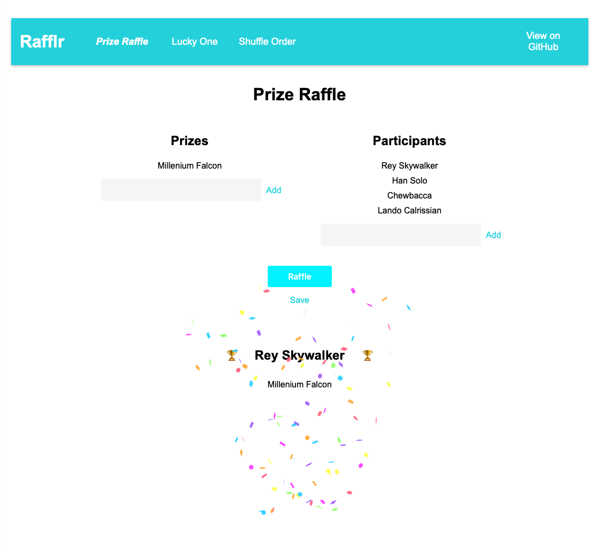

# Rafflr App

[🔗 Rafflr Site](https://rafflr.codesharegrow.net/)

[](https://github.com/hectortosa/rafflr/actions/workflows/build-and-deploy-azure-static-webapp.yml)

This is a simple app to do Raffles.



## General usage

### Adding multiple items

You can add several entries at the same time separated by semi-colon `;`.

### Saving setup

You can save your current setup by clicking in **Save** link. This will generate the url with the current setup and copy it to the clipboard (note this might not work on all borwsers if they don't support Clipboard API).

## Raffle Prizes

To use it, just add as many prizes and participants as you want by simply entering the value and pressing `Enter` or click `Add`. Press **Raffle** button to perform the raffle.

When the Raffle is performed, if there are more prizes than participants, and prizes cannot be equitably assigned to all participants, some prizes will be **To Share**, because sharing is caring.

## Lucky One

In this type of raffle, there is no need to add a list of prizes. The Lucky One will be selected randomly from the list of participants.

## Shuffle Order

This raffle will simply re-order the participants list. Simply add the participants and click on **Shuffle** button.

## Development

Rafflr uses [PNPM](https://pnpm.io/) + [Vite](https://vitejs.dev/) + [Lit](https://lit.dev/) + [TypeScript](https://www.typescriptlang.org/) (and their respectives required dependencies like Node).

To quickly setup your local environment, run

```bash
pnpm i
```

then

```bash
npm run dev
```
