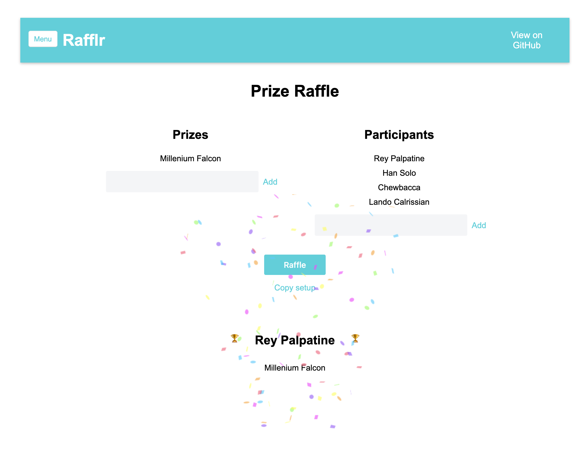

# Rafflr App

This is a simple app to do Raffles.

To use it, just add as many prizes and participants as you want by simply entering the value and pressing Enter (you can add several entries at the same time separated by semi-colon `;`). Press `Start Raffle` button to perform the raffle.

When the Raffle is performed, if there are more prizes than participants, and prizes cannot be equitably assigned to all participants, some prizes will be **To Share**, because sharing is caring.

